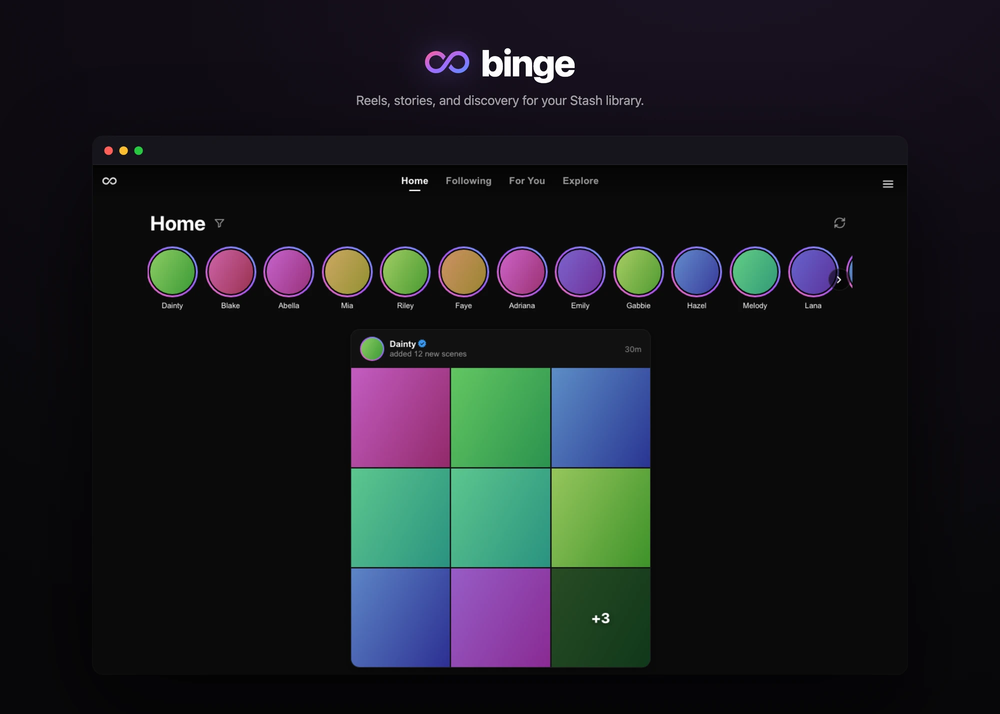

# Binge（汉化版）

> 基于 [ordureconnoisseur/binge](https://github.com/ordureconnoisseur/binge) v0.4.0 的中文汉化 + 功能修复分支。当前版本 **v0.8.8**。

为 [Stash](https://github.com/stashapp/stash) 提供的 Instagram 风格社交与发现层：竖屏 Reel、Stories、演员档案、StashDB 驱动的发现功能——全部基于 Stash 既有的 GraphQL API。Web 插件形态。

<p align="center"></p>

***

## 功能特性

- **竖屏 Reel** — 滑动浏览场景，双击点赞，操作栈（评分、多视图、Scribe、保存、⋯）。

- **首页 Stories + Feed** — IG 风格的演员 Stories 行（库内 + StashDB + 可选 Reddit）位于分页场景流上方。批量导入折叠为单个 Pack 卡片。

- **演员档案** — 简介、统计、场景网格、图库网格、社交链接条（Twitter / Instagram / TikTok / Reddit / OnlyFans / Fansly 品牌图标）。库内 + StashDB-only 变体共享布局。

- **StashDB 发现** — 首页的 DISCOVER + TRENDING 卡片；关注演员 + 添加你尚未拥有的场景。

- **移动优先** — 底部导航、悬停卡片迷你档案、演员 `@mention` 链接。触屏 + 桌面端一致体验。

***

## 汉化版变更说明

### UI 汉化

- **全部用户可见 UI 字符串翻译为中文**（导航、按钮、状态、设置、演员信息、场景信息、错误提示等）

- **日期格式**：`YYYY年M月D日`（如 `2024年2月28日`）

- **相对时间**：`刚刚` / `X分钟前` / `X小时前` / `X天前` / `X周` / `X个月` / `X年`

- **排序选项**：`最近` / `最多播放` / `最多高潮` / `最高评分` / `最近添加` 等

- **评分维度**：`总体` / `默契度` / `美感` / `制作质量` / `创意` / `外形` / `表现` 等

- 品牌名保持英文：Stash、StashDB、Reddit、X (Twitter)、PornHub、Cookie、forage、binge-server、HLS、MP4、WebM

### i18n 多语言架构（v0.4.17 新增）

v0.4.17 将原硬编码中文迁移为基于 `react-i18next` 的动态多语言架构：

- **中英双语**：内置中文（`zh`）和英文（`en`）两套翻译资源，默认中文，可在设置页切换语言，无需刷新

- **242 个翻译键**：按功能域分组，支持 `{{interpolation}}` 插值

- **语言偏好持久化**：`localStorage` key `binge.language`

- 详见 [汉化及修复.md](./汉化及修复.md)

### 功能修复

#### v0.8.x

- **导航滑块跟随 + A 点防刷新 + 收藏夹/包入口修复（v0.8.8）**：发现页点击场景后底部导航滑块正确划到推荐按钮（上游遗留 bug，附带收益：浏览器 back 可从 reel 返回发现页）；已停留推荐页时再点推荐按钮不再刷新循环时段 A 点（同 tab 重复点击不再误清 pin 触发 Reel 重载）；收藏夹点场景定位到所点场景、首页包马赛克点击按包内顺序播放（pin/queue 统一改为 setTab 后写入 + Reel 仅在用户清除筛选时退出包模式，修复空筛选入口自毁 queue）

- **javstash 冷加载优化 + 预告窗口/预告沉底 + 返回顶部分派（v0.8.7）**：newScenes 分页 `per_page` 100→1000 + count 终止、演员批次三波并发——javstash 源冷加载实测 40.7s → 约 7s；缓存新增 stale-while-revalidate，每日首次访问先秒开昨日数据、后台自动换新（7 天兜底）。新设置**预告窗口**（默认 7 天，关闭/7/14/30/60/不限）：JAV 源常提前数周放出元数据、远期预告普遍尚无资源，此处限制预告最远可出现的范围（缓存存全量，切换零网络成本，作用面含故事栏/发现/热门）；**预告沉底**开关（默认关）：开启后预告排到已发布内容之后、越临近发布的越靠前。返回顶部按钮改近距平滑/远距瞬时分派，修复从信息流深处回顶时平滑滚动被虚拟列表动态测量打断、停在中途的问题

- **首页近期窗口动态化 + 加载性能优化（v0.8.6）**：故事栏空态提示随「近期窗口」（7/14/30/60/90 天）动态显示实际天数，不再写死「过去 30 天」；首页 stories 与 discovery 共用 60 秒 memo 版已链接演员列表（消除双全库演员扫描），stories 联动与 discovery costar 共享 newScenes 12h 缓存 + in-flight 去重（835 位链接演员时外部批量请求 18 → 9）

- **全屏/竖屏 UI 布局终版（v0.8.5）**：全屏 UI 改 YouTube 式开场——进入默认隐藏、仅细条进度常驻可点，点按画面 / 移动鼠标 / 点击进度条唤出完整 UI（首次点按只唤出不切播放），淡出 3s→5s，退出复位可见；全屏与竖屏分开定位，UI 可见时进度条/时间码整体上移、隐藏时细条贴底（显隐升降动效）。竖屏导航联动改 React 类切换（原 CSS `:has()` 在用户浏览器失效重算不可靠）+ 合并为单一 `--binge-nav-lift` 刚性联动——胶囊大时七组元素同升 0.3rem、收缩回基准，相对间距恒定，右侧操作栈恒定 +0.8rem 不随滚动抖动。竖屏排布终版：进度条/时间码下沉（`nav-scrub - 0.7/-0.87rem`）、时间码水平对齐轨道、标题-进度条间距 +0.4rem。字幕底边内边距 8px→4px（竖屏/全屏通用）。电脑端微调：非全屏进度条上移 0.1rem，全屏进度条再上移 0.2rem + 标题上移 0.6rem（标题-进度条间距共 +0.4rem）

- **Reel 底部倒影 + 霜带（v0.8.4，合并上游 0.14.2）**：竖版画面在 9:16 屏幕上收尾于 seek 线上方约 77px 处，那段空隙原先是导航胶囊下方的裸黑。现在 seek 线到屏幕底部为一整条硬边霜带（毛玻璃），画面底边与屏幕边缘之间的空隙用 canvas 倒影填充（随视频 timeupdate 重绘、模糊下与实况无差别，不占解码器槽位）；本地适配——倒影几何读取实际 `object-position`（本地非全屏 30% 上移，上游假设居中），全屏时隐藏霜带/倒影（slide 进入 top layer、胶囊被遮蔽，同 overlay 贴底复位规则）

- **玻璃胶囊镜头化（v0.8.4，合并上游 0.14.1）**：第一版浮动导航是浅白水洗 + 强饱和提升，繁忙信息流上读作一块无轮廓的乳白污渍。改为"镜头"质感：烟熏底色（白图标在任意背景上保对比度）+ 30px 宽模糊（缩略图边缘不残留）+ 1px 边框与顶部高光（形状有界）；pill 自带 rim 读作胶囊内的凸起镜片，图标加 hairline 投影；sheet / modal / story 打开时胶囊淡出（半透明面板行恰在胶囊位置，图标会透面板而过）

- **移动端底部导航玻璃胶囊化（v0.8.3，合并上游 0.14.0）**：底部导航从固定实心栏重构为 iOS App 造型的浮动玻璃胶囊——内容跑到屏幕物理底部、从胶囊后方穿过（毛玻璃折射）；单一白色 pill 在 5 个槽位间滑动，向下滚动收缩、向上或点按恢复；全屏时 UI 复位贴底几何（本地适配）

- **从数据源修复空壳演员（v0.8.2，合并上游 0.13.0）**：Stash 自带 tagger / forage 刮削会产生"只有名字 + 图片 + 源链接"的空壳演员——没有性别（发现流性别过滤失效）、没有社交链接（Stories 圈不亮）、档案显示 0 场景（库内明明有她的戏）。演员档案 ⋯ 菜单新增**从数据源修复**：从活动数据源补全空缺列（只填空白、绝不覆盖已有值）并把她挂接到库内已有的源匹配场景（只增不删），完成后原位报告做了什么。全链路按活动数据源参数化（stash\_id 匹配、刮削、错误文案），结果报告中英双语；场景查询改"诚实失败"——首页查询失败不再伪装成"她没有场景"，重复修复自动跳过已挂接的场景不再虚报计数

- **i18n 补漏（v0.8.2）**：补齐 4 个存量缺失键（评分不可用 aria 标签、已评星提示、Pack 卡"再显示 N 个"），zh/en 各 673 键零缺失

- **数据源品牌名优化（v0.8.1）**：已知实例显示名品牌化——javstash.org 显示 "JAVStash"、theporndb.net 显示 "ThePornDB"（未知实例仍显示去 .org 后缀的主机名），全 UI 文案随源动态显示，大小写更美观

- **发现数据源可配置（v0.8.0）**：热门流、发现流、Stories 联动、关注、AddScene、演员页"未拥有"混排不再硬编码 stashdb.org——在 Stash 设置 → 插件 → binge 的 `sourceEndpoint` 填入任意 stash-box 实例的 GraphQL endpoint（如 `https://javstash.org/graphql`，须与 Stash 已配置的 stash-box 条目完全一致），重开 binge 页即全链路切换；未配置时行为与 v0.7.9 完全一致。缓存按源 host 隔离（切回旧源 TTL 内仍命中），follow/AddScene 写入的 stash\_ids 端点随源切换，全 UI 的 "StashDB" 文案/按钮随源动态显示为实例名（.org 后缀隐藏，如"在 javstash 上查看"），设置页新增数据源只读状态区（host + 链接演员计数健康提示，配置不匹配时说明回退原因）。已知局限：forage 联动仅支持 stashdb.org（其他源时入口禁用并说明）；单源库切源后联动流为空（需先用目标实例刮削库，设置页会黄字警告）；双源库（演员同时挂两个 stash\_ids）可无损切换

- **构建产物齐套（v0.8.0）**：`npm run build` 后 dist/ 与 release zip 布局一致（自动补入 `binge.yml`，4 文件根层级），整目录拷入 Stash 插件目录即可本地测试

#### v0.4.0–v0.7.9（合并摘要）

- **合并上游 0.12.x**：设置页搜索 + 分组、StashDB 网络降级优化、安全修复（外部 URL 过滤、`redirect: "error"`）、Docker 命名卷、安装探针、daemon 信任区修复；本地定制全部保留
- **PH 保存超时**：`saveToStash` 超时 30s → 245s 对齐 daemon 4 分钟下载预算；daemon 认证回退上游 `ApiKey` 写法
- **播放交互**：进度条拖动擦洗（时间码气泡、松手跳转）+ 命中区扩容；转码流冷启动 / 硬 seek 弧形转圈 + 居中定位修复
- **页面稳定性**：演员详情页 tab 切换不抖动不闪跳；Stories 弹窗卡片居中与等比收缩；设置页输入框窄屏溢出修复
- **设置页收尾 + 代码清理**：赞助信息弱化为页脚、属性行 `color.*` 翻译、passive listener 报错与 hover 态残留修复

- **i18n 多语言架构**：react-i18next 中英双语，设置页切换，585 个翻译键

- **随机时段播放**：随机起点 + 循环时长（留空播到结尾）

- **字幕**：自动加载 srt/vtt，描边样式，随视频宽度缩放

- **全屏体验**：UI 自动隐藏、横滑快进快退、长按 2× 倍速、退出稳定性修复

- **转码流播放**：断点自动重连（熔断/假结尾识别）、后台回前台预热、AVI/WMV 快进修复

- **播放层栈 + 静音全局同步**：覆盖层打开下层视频暂停，任一时刻只有一个声音

- **图片查看器 / 图库卡片**：原生滚动 + 吸附重构、桌面拖拽翻页（`useDragPaging`）、交互后停止自动轮播

- **Stories 头像行秒开**：外部源后台并行合并，单源挂掉只降级

- **X 弹窗**：就地播放、保存到 Stash、触屏划动翻页

- **binge-server 集成**：API Key 认证、一键安装、cookies.txt 导入、保存进度条

- **合并上游 v0.5.0–v0.6.4 全部提交**：信息流改进、安全加固（daemon URL 信任规则）、安装 SHA256 校验、死模块清理

- **通用 SortMenu 组件**：深色浮层菜单替换原生 select，桌面/手机一致

- 其余为布局/字号/间距/图标等微调与优化，详见 [汉化及修复.md](./汉化及修复.md)

> 完整修复记录详见 [汉化及修复.md](./汉化及修复.md)。

### 技术实现

所有修改在 **TypeScript 源码级别**完成（非压缩 JS 补丁），具体见 [汉化及修复.md](./汉化及修复.md)。

***

## 安装

### 方式一：下载 Release

1. 前往 [Releases 页面](https://github.com/k6cc/binge-cn/releases)
2. 下载最新版本的 `binge-vX.Y.Z.zip`
3. 解压到 Stash 插件目录（zip 内文件直接放在 binge 目录下）：

   - **Windows**: `%USERPROFILE%\.stash\plugins\binge\`

   - **Linux/macOS**: `~/.stash/plugins/binge/`
4. Stash → 设置 → 插件 → 重新加载插件

### 方式二：添加插件源

在 **Stash → 设置 → 插件 → 可用插件 → 添加源** 中添加以下任一 URL：

**推荐（GitHub Pages，需启用 Pages）**：

```
https://k6cc.github.io/stash-plugins/plugins/main/index.yml
```

**备用（raw URL，无需启用 Pages，立即可用）**：

```
https://raw.githubusercontent.com/k6cc/stash-plugins/main/plugins/main/index.yml
```

> **启用 Pages 步骤**：stash-plugins 仓库 → Settings → Pages → Source: `Deploy from a branch` → Branch: `main` / `(root)` → Save。等待 1-2 分钟后 `k6cc.github.io/stash-plugins/` 即可访问。

> 此 URL 是统一插件源，同时包含 Binge、nfoSceneParser、sceneTranslate 等多个插件，可一并安装。

然后从列表中安装 **Binge**。

安装后需手动开启导航按钮（默认关闭）：**Stash → 设置 → 界面 → 基本设置 → 菜单选项**，勾选 **Binge**。之后 Stash 主导航栏会出现一个无穷符号按钮——点击即可。

> ⚠️ 这一步不可省略且容易遗漏：Stash 只在插件 id 出现在菜单选项列表中时才渲染其导航按钮，而全新安装默认不含它——不勾选则任何地方都不会出现按钮，插件看起来像安装失败。

### 手动部署

```bash
unzip binge-vX.Y.Z.zip -d ~/.stash/plugins/binge/
# 然后：Stash → 设置 → 插件 → 重新加载插件
```

偏好设置存储在 `localStorage` 的 `binge.*` 命名空间下——不会修改 Stash 自身的配置。

***

## 设置

打开 binge → ⋯ → 设置（桌面端）或 菜单 → 设置（移动端）。

| 设置项                | 默认值                     | 说明                                                          |
| ------------------ | ----------------------- | ----------------------------------------------------------- |
| 显示性别               | 全部                      | 五个开关。驱动发现流 + 发现演员行。                                         |
| 流媒体类型              | 自动                      | 自动 / 直连 / MP4 / WebM / HLS                                  |
| 在动态中显示图库           | 开                       | 在首页混入图库                                                     |
| 近期窗口               | 30 天                    | "新"的回溯范围。7 / 14 / 30 / 60 / 90 / 180 / 365                  |
| 在故事中包含 StashDB 新发布 | 开                       | 无 StashDB API 密钥时无效。                                        |
| 场景混入演员档案           | 关                       | 也可在档案场景标题处通过 pill 切换                                        |
| 在故事中包含 Reddit 帖子   | 开                       | 需要 binge-server 可达（否则静默跳过）                                  |
| binge-server URL   | `http://localhost:7878` | 远程时覆盖                                                       |
| binge-server 配置    | —                       | 自动检测 Stash API 密钥 + 接受 Reddit cookie。仅在 binge-server 可达时可见。 |
| 跟随 refract 强调色     | 关                       | 将 refract 的强调色调色板镜像到 binge                                  |
| 自动滚动               | 关                       | 当前场景结束时前进到下一个（reel ⋯ 菜单）                                    |
| 随机时段               | 关                       | 从随机位置开始播放；循环时长留空播到结尾，填秒数到时循环/切换（reel ⋯ 菜单）                  |
| 显示调试覆盖层            | 关                       | 每个幻灯片的调试 HUD；reel 中按 `\` 热键                                 |

***

## 伴侣插件集成

运行时检测——按需安装任一；binge 在缺失时优雅降级。

| 插件                                                                                  | 增加的功能                                 |
| ----------------------------------------------------------------------------------- | ------------------------------------- |
| [Refract](https://github.com/ordureconnoisseur/stash-refract)                       | 将 binge 的强调色调整为匹配你的 refract 调色板（可选开关） |
| [stash-multiview](https://github.com/ordureconnoisseur/stash-multiview)             | 操作栈中的 4 格网格按钮——点击排队，长按打开              |
| [stash-advanced-rating](https://github.com/ordureconnoisseur/stash-advanced-rating) | Reel + 档案中的按维度 0–5 评分模态框              |
| [stash-scribe](https://github.com/ordureconnoisseur/stash-scribe)                   | Scribe 铅笔 → LLM 驱动的评价撰写               |
| [binge-server](https://github.com/ordureconnoisseur/binge-server)                   | Stories 行中的 Reddit 帖子（独立的 Go 守护进程）    |

***

## 架构

- **Vite + React 19 + TypeScript** 打包为单文件 SPA（`dist/index.html`），由 Stash 从 `/plugin/binge/assets/index.html` 提供。`binge.entry.js` 注入导航按钮。

- **所有 Stash 数据通过 GraphQL**（`/graphql`，同源 cookie 认证）。binge 自身后端。

- **StashDB 直连** — 使用用户的 API 密钥查询 `https://stashdb.org/graphql`（从 Stash 的 stashbox 配置读取）。12 小时 localStorage 缓存。

- **哈希路由** — `#/home`、`#/foryou`、`#/explore`、`#/following`、`#/saved`、`#/settings`、`#/menu`、`#/p/<id>`、`#/sdbp/<id>`。支持直接深链 + 浏览器后退。

- **运行时插件检测** — ASR / scribe / multiview / refract 在启动时查询，通过 React Context 门控。

***

## 开发

```bash
git clone https://github.com/k6cc/binge-cn.git
cd binge-cn
npm install
npm run dev     # Vite 开发（仅 SPA — 无 Stash 数据）
npm run build   # 产出 dist/index.html
```

技术栈：Vite · React 19 · TypeScript · TanStack Virtual（Reel 虚拟化）。

### i18n 工具

`scripts/i18n/` 下提供 6 个 Node.js 脚本辅助翻译键维护（详见 [scripts/i18n/README.md](./scripts/i18n/README.md)）：

| 脚本                           | 用途                                 |
| ---------------------------- | ---------------------------------- |
| `scan_missing_keys.cjs`      | 扫描 `t()` 调用，找出 zh.ts / en.ts 中缺失的键 |
| `find_hardcoded_chinese.cjs` | 扫描未用 `t()` 包裹的硬编码中文字符串             |
| `sync_en_from_source.cjs`    | 英文源码升级后，同步 en.ts 的大小写/空格/标点        |
| `validate_en.cjs`            | 校验 en.ts 的空值、中文残留、`{{*}}` 残留       |
| `remove_fallbacks.cjs`       | 批量移除 `t()` 调用中的冗余 fallback 字符串     |
| `analyze_bundle.cjs`         | 分析 i18n bundle 体积构成                |

```bash
node scripts/i18n/scan_missing_keys.cjs      # 新增组件后检查缺失键
node scripts/i18n/find_hardcoded_chinese.cjs # 检查遗漏的硬编码中文
node scripts/i18n/sync_en_from_source.cjs    # 英文源码升级后同步 en.ts
```

***

## License

AGPL-3.0. See [LICENSE](./LICENSE).（与 Stash 自身许可证一致。）

***

## 致谢

- 原项目：[ordureconnoisseur/binge](https://github.com/ordureconnoisseur/binge)

- 汉化及修复详见 [汉化及修复.md](./汉化及修复.md)

<br />
